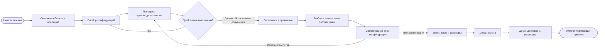
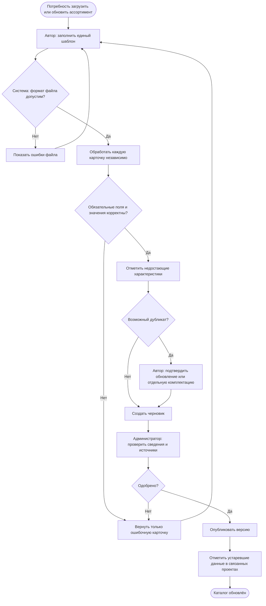
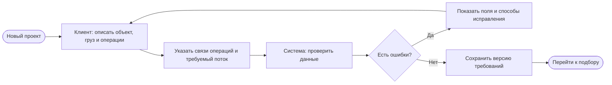
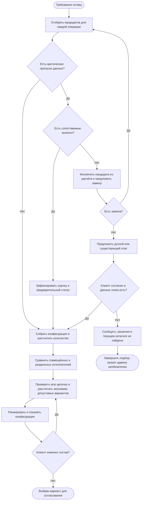
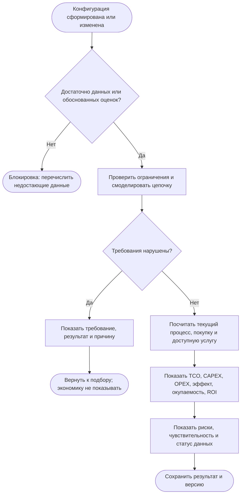
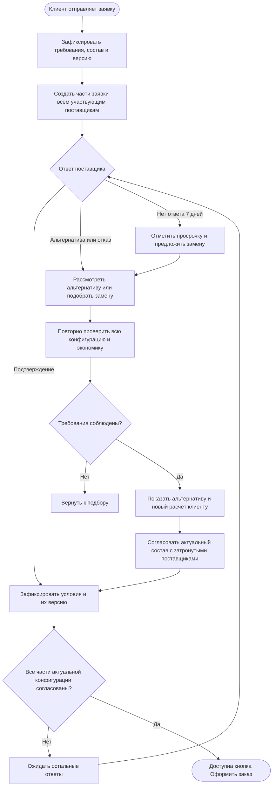
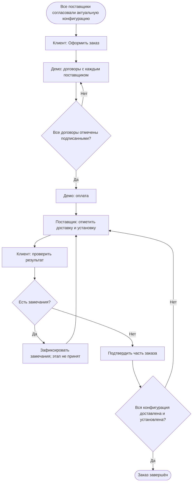
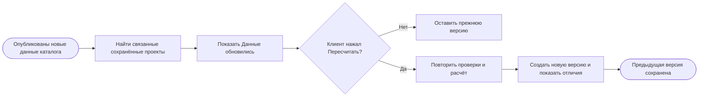

# Робоскоп: процессы и задание команде

Версия 1.0 · 28 сентября 2026 · согласованные требования из обсуждения.

Этот документ фиксирует целевое поведение продукта, а не подтверждает его реализацию. Текущее состояние сверено с локальным кодом `0964680`. Изменения приложения по этому документу ещё не внесены. Финальная сдача — 29 сентября; объём новых функций значителен, срок их реализации здесь не обещается.

## 1. Границы прототипа

Робоскоп помогает описать складскую задачу, собрать конфигурацию исполнителей, проверить её производительность, сравнить экономику и согласовать оборудование с поставщиками.

**Решение** — конфигурация моделей роботов, их количества и назначения на операции конкретного заказчика. С согласия заказчика часть операций остаётся людям или существующей технике. Решение не равно отдельной карточке робота.

**Рабочие процессы:** каталог и модерация, описание объекта, подбор смешанной конфигурации, симуляция и экономика, заявки и согласование внутри платформы.

**Только демонстрация:** оформление заказа, договоры, оплата, доставка и установка. Кнопки изменяют демонстрационные статусы; реальная оплата, юридическое подписание и отправка заказов во внешние системы не выполняются. Это явно обозначается в интерфейсе и презентации.

**За рамками:** изменение складских процессов системой, детальное инженерное проектирование, поддержка после приёмки, обязательная интеграция с API поставщиков. Наличие API не предполагается без проверки конкретного поставщика.

Сервис собирает конфигурации только из текущего опубликованного каталога. Не найденное решение не означает, что его не существует на рынке. Пополнение каталога не задерживает текущий заказ.

## 2. Роли и ответственность

| Роль | Действия и границы доступа |
|---|---|
| Гость | Просмотр каталога, демонстрационная оценка; для собственных сохранённых проектов и заявок нужен аккаунт |
| Заказчик | Свои проекты, требования, версии, выбор конфигурации, заявки, ответы, демонстрационный заказ и приёмка |
| Поставщик | Только свой ассортимент, черновики, замечания модерации и адресованные ему части заявок; ответы и альтернативы |
| Администратор | Весь каталог, импорт, модерация, источники и разбор запросов на недостающее оборудование |
| Система | Проверка, расчёт, сравнение, статусы, уведомления, история; не принимает коммерческие обязательства за клиента |

Платформа организует взаимодействие. Продавцами и сторонами договоров в целевом процессе выступают поставщики, не платформа.

## 3. Общая схема

Схемы ниже — **эскизы процессов в Mermaid**, а не BPMN 2.0 XML. Они пригодны для обсуждения и переноса в BPMN-редактор. При переносе внешних участников можно оформить отдельными пулами и соединить обмен сообщениями потоками сообщений; действия платформы — дорожками её пула. Ромбы означают решения, а не автоматически параллельные шлюзы.

Проверка и экономика — внутренний цикл подбора: система должна рассчитать допустимые кандидаты, чтобы ранжировать их. Она не заставляет клиента вручную проверять каждый вариант. Нельзя ранжировать произвольный парк до проверки требований. Утверждение «оптимальный» означает лучший среди рассмотренных допустимых конфигураций по зафиксированным критериям, а не доказанный глобальный оптимум рынка.

## 4. Процесс 1 — каталог и модерация

**Вход:** единый шаблон ассортимента и подтверждающие материалы. Поставщик и администратор могут наполнять каталог. Параметры склада клиента загружаются отдельно — это другой шаблон и другой процесс.

**Выход:** опубликованная версия карточки либо конкретные замечания автору.

Правила:

- При ошибках в 5 из 100 карточек остальные 95 проходят на модерацию. Ошибка формата всего файла блокирует его разбор.
- Для идентификации обязательны производитель, модель, назначение и источник сведений. Артикул используется вместе с производителем и названием для поиска совпадений; правила для моделей без артикула команда оформляет явно, без автоматического слияния.
- Габариты, грузоподъёмность, автономность, стоимость и комплектация важны для оценки; применимость поля зависит от типа оборудования. Отсутствие необязательной характеристики не блокирует публикацию.
- Неполная карточка публикуется с отметкой. Она не считается подтверждённо подходящей, если неизвестно критическое ограничение.
- Для характеристик хранятся единицы, источник, дата и признак подтверждённости. Противоречащие источники не объединяются молча.
- Новый вариант опубликованной карточки проходит проверку. До одобрения доступна прежняя версия.
- Совпадение не означает автоматическое обновление: автор подтверждает, что это та же модель и комплектация.
- Оценка цены по сопоставимым аналогам хранится отдельно от предложения поставщика, с диапазоном, основанием и одобрением администратора. По ней можно делать предварительную экономику, но нельзя выдавать её за цену заказа.
- Разрозненные сведения с сайтов и паспортов команда собирает в тот же формат. Автоматический сбор не заменяет модерацию; универсальный парсер произвольных файлов в границы не входит.

## 5. Процесс 2 — описание склада и задачи

**Вход:** сведения заказчика вручную или из шаблона. **Выход:** проверенная версия требований.

Проверяются обязательность, тип, единицы, диапазоны и взаимная согласованность: например, рабочая зона не больше площади склада. Уже введённые значения при ошибке сохраняются.

Для смешанного парка нужны операции, последовательные и параллельные связи, объёмы и пиковый поток, время работы, маршруты, места выполнения, буферы и возможность оставить груз. Для ручных этапов — число исполнителей, производительность, график и стоимость труда. Система не переопределяет операции или связи ради доступного оборудования.

Бюджет необязателен. Его отсутствие не мешает расчёту. Малый бюджет не делает технически подходящий вариант несовместимым.

## 6. Процесс 3 — формирование конфигурации

**Вход:** требования проекта и опубликованный каталог. **Выход:** допустимые конфигурации либо объяснение, почему подбор не состоялся.

Правила выбора:

1. Все операции имеют исполнителя, подтверждённые технические ограничения соблюдены.
2. Один робот может выполнять несколько операций, только если способен их выполнять; его доступное время нельзя дважды засчитывать. Объединение исполнителя не меняет сам процесс.
3. Сначала рекомендуются конфигурации с полностью подтверждёнными необходимыми данными. Затем отдельно — предварительные варианты с допущениями.
4. Внутри каждой группы порядок — по возрастанию **TCO за пять лет**. Избыток производительности сам по себе не преимущество, за которое нужно переплачивать.
5. Показываются расчётная предельная нагрузка, запас и условия, при которых оценка применима. Предел определяется проверкой сценариев нагрузки, а не произвольным процентом.
6. Подписка предлагается только при наличии условий поставщика в каталоге. Неизвестный тариф не создаёт доступного предложения услуги.
7. При указанном бюджете отображаются первоначальные вложения и превышение. Можно предложить увеличение бюджета или доступную услугу; бюджет автоматически не изменяется. Превышение бюджета не блокирует просмотр экономики.
8. Если сведения отсутствуют, используются оценки по сопоставимым моделям с сохранением списка аналогов и способа усреднения. Назначение, класс, характеристики и комплектация должны быть сопоставимы; один производитель — дополнительный признак. Метод сопоставления ещё необходимо специфицировать и проверить команде данных.
9. При отсутствии и данных, и пригодных аналогов расчёт кандидата останавливается. Неизвестное значение нельзя заменить нулём или выдуманным нормативом.
10. Ручной этап допускается только с согласия клиента. Если вариантов нет, запрос админу служит пополнению каталога для будущих заказов; текущий процесс не ждёт ответа и автоматически не возобновляется.

## 7. Процесс 4 — производительность и экономика

**Вход:** конфигурация и неизменённые требования. **Выход:** проверка достижимости и сопоставимые расчёты, либо возврат к подбору.

**Позднее согласованное правило заменяет прежнее:** подтверждённо несовместимую конфигурацию нельзя проводить в экономику с одним лишь предупреждением. Её экономика скрыта, клиент возвращается к подбору. Если есть обоснованные оценки по аналогам и нарушения не обнаружены, расчёт доступен с явным предварительным статусом. Положительный результат модели на допущениях не подтверждает реальные характеристики.

Модель учитывает последовательность и параллельность, очередь, буферы, общий проезд, места операций, занятость людей и роботов, зарядку. Очередь в исходной зоне не считается устранённой проблемой только потому, что робот свободен. Точное геометрическое планирование траекторий и столкновений не заявляется без реализации.

Экономика включает оставшийся персонал, вспомогательное оборудование, внедрение и эксплуатацию. Одни и те же расходы не считаются дважды: например, сервис, уже включённый в подписку. Сравнивается одинаковый объём задачи и одинаковый горизонт; выгода считается относительно текущего процесса.

Если условия услуги отсутствуют, нельзя выдумывать третий коммерческий сценарий. Для демонстрации требования ТЗ «текущий процесс / покупка / услуга» нужен заранее подготовленный набор с явно указанным происхождением тарифа и его демонстрационным статусом.

## 8. Процесс 5 — заявки и согласование

**Вход:** выбранная конфигурация и версия расчёта. **Выход:** согласована вся актуальная конфигурация либо клиент возвращается к выбору.

Каждый поставщик получает свою часть и необходимые требования, а не доступ ко всем частным данным проекта. Общение и история ответов находятся внутри платформы. Дополнительное подтверждение клиента перед **показом** допустимой альтернативы не нужно; предложение альтернативы не означает автоматический заказ. Для выбранного клиентом состава сохраняется финальное действие «Оформить заказ».

При изменении версии нельзя считать старые подтверждения автоматически действующими для изменённых позиций. В прототипе рекомендуется повторно подтверждать затронутые части; это техническое правило целостности, а не новая коммерческая функция.

Через 7 дней без ответа обращение просрочено, предлагается замена, но конфигурация и заказ автоматически не меняются. Для реализации по умолчанию считать 7 календарных дней от отправки; это техническое уточнение, в разговоре рабочие/календарные дни отдельно не выбирались.

## 9. Процессы 6–7 — демонстрация сделки и исполнения

Финальная приёмка — подтверждение доставки и установки, не отдельное испытание фактической производительности. Помощь после приёмки в эту схему не включена. Образцы договоров и платежные статусы нельзя представлять как реальные подписанные документы или платежи.

## 10. Сквозной процесс — версии и уведомления

Версия содержит требования, состав, использованные версии карточек, цены и тарифы, источники, допущения, результаты модели и время расчёта. Изменение каталога не переписывает старую экономику. При повторном расчёте требования могут перестать выполняться — тогда новая версия показывает блокировку, а не устаревшие цифры как актуальные.

## 11. Что есть сейчас и что нужно сделать

| Область | Уже реализовано | Требуется доработка / новый блок |
|---|---|---|
| Аккаунты | Гость, пользователь, администратор; собственные проекты | Роль и организация поставщика, изоляция ассортимента и заявок |
| Каталог | 187 продуктов, источники, характеристики, поиск, админка | Версии карточек, модерация, единый новый шаблон, построчные ошибки, подтверждение совпадений |
| Импорт каталога | CSV организатора, обновление по source_id, транзакция на весь файл | Независимая обработка карточек, предпросмотр, замечания и повторная загрузка |
| Объект | 55 параметров склада, проверки, импорт Excel/CSV | Операции и связи, ручные этапы, буферы, необязательный бюджет |
| Подбор | Применимость отдельных продуктов и сравнение карточек | Генерация смешанных конфигураций, распределение операций и общего ресурса, ранжирование по достоверности и TCO |
| Оценки | Редактируемые нормативы и обозначенные допущения | Воспроизводимая оценка по аналогам с основаниями и блокировкой без аналогов |
| Симуляция | Типовой склад, один тип робота, очереди, зарядка, worker | Связанная сеть операций, смешанный парк, ручные ресурсы и буферы |
| Экономика | Три сценария, CAPEX/OPEX/TCO/ROI/окупаемость, чувствительность | Составной парк, предложения поставщиков, новые блокировки; сейчас при провале симуляции экономика остаётся с предупреждением |
| Версии | Сохранённые версии проекта и результатов | Связи с версиями каталога, уведомления и сравнение изменений |
| Экспорт | PDF, Excel, JSON | Расширение на составную конфигурацию и статусы достоверности |
| Заявки | Нет | Заявки всем поставщикам, кабинет ответов, альтернативы и таймер 7 дней |
| Сделка | Нет | Только демонстрационные статусы заказа, договоров, оплаты, доставки и установки |
| Безопасность | HTTPS, редирект, HSTS, secure cookies, CSRF, хеши паролей, защита входа и доступ по владельцу | Применить разграничение к новым сущностям и проверить роль поставщика; полный аудит не выполнялся |

Размещение: Render, сервис `roboscope`, PostgreSQL `roboscope-db`, внутреннее соединение через `DATABASE_URL`. Публичный адрес: https://roboscope-5562.onrender.com. HTTPS проверен 26 сентября. Локально без `DATABASE_URL` используется отдельная SQLite. Бесплатная Render PostgreSQL создана 19 сентября и ограничена сроком 30 дней; это не бессрочная инфраструктура.

## 12. Предлагаемая модель данных для коллеги по SQL

Это проект структуры, миграции ещё не созданы. Существующие `Product`, `Project`, `ProjectVersion`, `SimulationRun` следует расширять с сохранением данных.

| Сущность | Назначение и основные связи |
|---|---|
| Supplier / Membership | Организация поставщика и пользователи с её правами |
| ProductRevision | Версия карточки Product; автор, статус проверки, источник, комплектация |
| CharacteristicEvidence | Значение, единица, источник, дата, подтверждённость; связь с версией карточки |
| CommercialOffer | Покупка/услуга, поставщик, состав тарифа, цена, дата и версия условий |
| ImportBatch / ImportRow | Файл загрузки и независимые результаты строк, замечания, решение о совпадении |
| ReviewDecision | Кто и когда одобрил или вернул версию, причины |
| Operation / OperationLink | Операции версии проекта, связи, потоки, буферы и ограничения |
| Configuration / Assignment | Вариант конфигурации и назначения роботов/людей; общий исполнитель может обслуживать несколько операций |
| Assumption | Оценка, аналоги, метод, статус; не заменяет исходное неизвестное значение |
| CalculationSnapshot | Неизменяемая совокупность входных данных, версий, результатов и допущений |
| Request / SupplierRequest | Общая заявка и части по поставщикам с привязкой к версии конфигурации |
| SupplierResponse | Подтверждение, отказ или альтернатива, версия предложения |
| Notification | Получатель, событие, связанный проект/заявка, прочитано |
| DemoOrder / Stage | Демонстрационные статусы договора, оплаты, поставки и приёмки; явный флаг demo |

Денежные значения — decimal и валюта; физические величины — явные единицы. Не хранить несколько несовместимых смыслов статуса в одном поле: полнота данных, модерация и техническое соответствие — разные признаки. Для конфигурации сохранять идентификатор общего ресурса, чтобы один робот не учитывался как два независимых исполнителя.

## 13. План работ команды

Предлагаемое распределение по компетенциям, не персональное назначение. Все новые блоки ниже пока не реализованы.

| Очередь | Результат | Кто ведёт | Зависимость |
|---|---|---|---|
| 1 | Формат требований, карточки, операции и версии; схема БД и миграции | SQL + Python | Этот документ |
| 2 | Роль поставщика, единый шаблон, импорт, модерация | Python + SQL | 1 |
| 3 | Проверенный демонстрационный каталог, характеристики, тарифы и аналоги | Экономист/аналитик данных | 1; параллельно с 2 |
| 4 | Операции, конфигурации, смешанные ресурсы, генерация кандидатов | Python + экономист | 1, 3 |
| 5 | Симуляция, проверка требований, TCO и ранжирование | Python + экономист | 4 |
| 6 | Заявки, ответы поставщиков, повторная проверка альтернатив | Python + SQL | 2, 5 |
| 7 | Демо сделки; понятные статусы и интерфейсы ролей | Python + дизайнер | 6; макеты можно готовить ранее |
| 8 | Полный демонстрационный прогон, отчёт, инструкция и презентация | Вся команда; дизайнер ведёт презентацию | 2–7 |

До реализации функций не отмечать их готовыми. Не маскировать статические экраны под действующую оптимизацию или работающий платёжный процесс. Если объём не помещается в срок, сокращение рабочей части согласовывается отдельно: документ сам по себе не переводит процессы 1–5 в демонстрационные.

## 14. Приёмочные сценарии

1. Импорт 100 карточек с пятью ошибочными строками: 95 уходят на проверку, пять получают точные замечания; публикации без модерации нет.
2. Найден возможный дубликат: автор подтверждает действие; действующая карточка сохраняется до одобрения новой версии.
3. Неполная карточка публикуется с отметкой. Нет критических данных и аналогов — кандидат не рассчитывается; предлагается замена.
4. Процесс клиента остаётся неизменным. Система рассматривает совмещённых и раздельных исполнителей, не удваивая их рабочее время.
5. Несовместимый парк не имеет доступной актуальной экономики. Допущения дают предварительный статус; отсутствие бюджета не блокирует подбор.
6. Подтверждённые варианты идут раньше оценочных, внутри групп TCO возрастает. Предел нагрузки имеет воспроизводимое основание.
7. Обновление каталога не меняет старый расчёт. По кнопке создаётся новая версия и показываются изменения.
8. Заявки получают все участвующие поставщики; чужой поставщик и другой клиент не видят их. Альтернатива проходит полную проверку.
9. Нет ответа семь дней — просрочка и предложение замены. Заказ не оформляется до согласования всего актуального состава.
10. Демо-оплата недоступна до отметки всех договоров подписанными. Приёмка всей конфигурации требует подтверждения доставки и установки клиентом; реальные деньги и подписи не используются.
11. Экспорт, интерфейс и презентация одинаково показывают версии, допущения и демонстрационные ограничения. Новые функции работают через HTTPS и соблюдают права ролей.

## 15. Решения, которые заменили ранние обсуждения

- Несоответствие техническим требованиям блокирует экономику; прежнего «продолжить с предупреждением» нет.
- Система не предлагает менять складские процессы или планировку ради доступных роботов. Она подбирает исполнителей под заданный процесс.
- Каталог может быть неполным, но нельзя выдавать неизвестные характеристики за подтверждённые.
- Запрос на недостающее оборудование не удерживает текущий заказ в ожидании и не запускает его позже автоматически.
- Приёмка ограничена фактом доставки и установки; отдельную приёмку производительности и поддержку после неё не проектируем.
- Заказ, договоры, платежи и исполнение в хакатонной версии демонстрационные; каталог, подбор, расчёт и согласование заявлены рабочими целями.

## 16. Технические решения, которые команда ещё должна специфицировать

Не требуют нового подробного разбора бизнес-процесса, но не должны быть скрыты в коде: точный список полей единого шаблона по классам роботов; критерии пригодности аналогов и усреднения; генерация ограниченного набора конфигураций; метод определения предельной нагрузки; сценарий услуги с доступными исходными данными; политика подтверждения затронутых заявок при замене. Отсутствующие данные не восполняются недокументированными коэффициентами.
